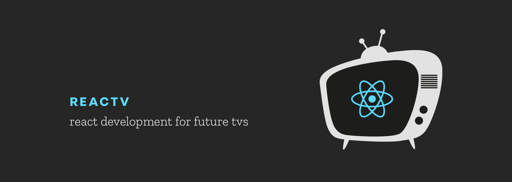
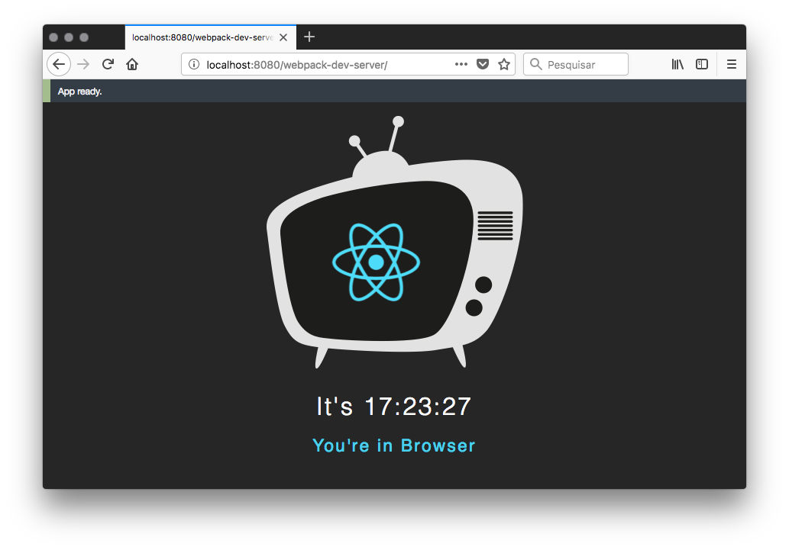

# [React-TV](https://github.com/raphamorim/react-tv) · []() [](https://www.npmjs.com/package/react-tv) [](https://circleci.com/gh/raphamorim/react-tv) [](https://ci.appveyor.com/project/raphamorim/react-tv/branch/master) [](CONTRIBUTING.md#pull-requests)

> <p>react-tv: React Renderer for low memory applications.</p><p>react-tv-cli: React Packager for TVs.</p><p>Currently under development.</p>



```jsx
import React from 'react'
import ReactTV, { Platform } from 'react-tv'

class Clock extends React.Component {
  state = { date: new Date() }

  componentDidMount() {
    setInterval(() => this.setState({date: new Date()}), 1000)
  }

  render() {
    if (Platform('webos')) {
      return (
        <h1>Time is {this.state.date.toLocaleTimeString()}</h1>
      )
    }

    return <h2>This App is available only at LG WebOS</h2>
  }
}

ReactTV.render(<Clock/>, document.getElementById('root'))
```

## Summary

- [About React-TV](#about-react-tv)
  - [Understanding the Problem](#understanding-the-problem)
  - [Articles](#articles)
- [react-tv-cli](#react-tv-cli)
  - [Developing for WebOS](#developing-for-webos)
- [react-tv](#react-tv)
  - [`Platform`](#platform)
  - [`renderOnAppLoaded`](#renderonapploaded)
  - [Spatial Navigation](#navigation)
- [Examples](#examples)
    - [Clock App](#clock-app)
    - [Youtube App](#youtube-app)
- [References for Study](#references)
  - [WebOS](#webos)
  - [Videos](#videos)
  - [Essentials to beginner](#essentials-to-beginner)
  - [React Basics and Renderer Architecture](#react-basics-and-renderer-architecture)
- [Roadmap](#roadmap)
- [Credits](#credits)

## About React-TV

React-TV is an ecosystem for TV based React applications (from the renderer to CLI for pack/build applications).  
At the moment we're focusing on WebOS and SmartTV.  
React-TV's aims to be a better tool for building and developing fast for TVs.

### Understanding the Problem

**tl;dr:** [Crafting a high-performance TV user interface using React](https://medium.com/netflix-techblog/crafting-a-high-performance-tv-user-interface-using-react-3350e5a6ad3b)

Crafting a high-performance TV user interface using React is a real challenge, because of some reasons:

- Limited graphics acceleration
- Single core CPUs
- High Memory Usage for a common TV App

These restrictions make super responsive 60fps experiences especially tricky. The strategy is **step in the renderer**: Applying reactive concepts to unblock the processing on the renderer layer, plug the TV's keyListener, avoid React.createElement.

In addition: Unify the build for multiple TV platforms.

### Articles

Friendly list of tutorials and articles: 

- [Developing for TVs with React-TV](https://medium.com/@raphamorim/developing-for-tvs-with-react-tv-b5b5204964ef)

## [react-tv-cli](https://www.npmjs.com/package/react-tv-cli)

To install `react-tv-cli` (CLI Packager):

```bash
$ yarn global add react-tv-cli
```

##### Support for React-TV-CLI

| Target Platform | Status | Available Version |
| --- | --- | --- |
| `LG WebOS` | stable | 0.3.1 |
| `Samsung Tizen` | [ongoing](https://github.com/raphamorim/react-tv/pull/104) | x |
| `Samsung Orsay` | not started yet | x |
| `Sony PS4` | not started yet | x |
| `Nintendo Switch` | not started yet | x |

### Developing for WebOS

<p align="center"></p>

**Short Description:** WebOS, also known as Open WebOS or LG WebOS, (previously known as HP WebOS and Palm WebOS, stylized as webOS) is a Linux kernel-based multitasking operating system for smart devices such as Smart TVs and it has been used as a mobile operating system.

--------------------------------------------------------

First of all, follow the instructions to install the SDK and [Setup your WebOS Environment](docs/setup-webos-environment.md).

Then, init your react-tv project:

```bash
$ react-tv-cli init <my-app-name>
```

From the project directory, install the dependencies to enable building:

```bash
$ yarn install
```

You will need to keep the list of files related to your app on the React-TV entry up to date in `package.json`. The init command will already add `index.html`, `bundle.js` and `style.css` to the package.

```json
{
  "name": "my-app-name",
  "react-tv": {
    "files": [
      "index.html",
      "bundle.js",
      "style.css"
    ]
  }
}
```

To build your project:

```bash
$ yarn build
```

Once the project is built, you can run it on a specific device or emulator:

```
$ react-tv-cli run-webos <device>
```

* If you do not specify a device, it runs on VirtualBox WebOS Simulator.

## [react-tv](https://www.npmjs.com/package/react-tv)

To install `react-tv` (React Renderer):

```bash
$ yarn add react-tv
```

### `Platform`

When building a cross-platform TV app, you'll want to re-use as much code as possible. You'll probably have different scenarios where different code might be necessary.  
For instance, you may want to implement separated visual components for `LG-WebOS` and `Samsung-Tizen`.

React-TV provides the `Platform` module to easily organize your code and separate it by platform:

```js
import { Platform } from 'react-tv'

console.log(Platform('webos')) // true
console.log(Platform('tizen')) // false
console.log(Platform('orsay')) // false
```

### `renderOnAppLoaded`

Takes a component and returns a higher-order component version of that component, which renders only after application was launched, allows to not write diffent logics for many devices.

```js
import { renderOnAppLoaded } from 'react-tv'

const Component = () => (<div></div>)
const App = renderOnAppLoaded(Component)
```

### `findDOMNode`

Similar to [react-dom findDOMNode](https://reactjs.org/docs/react-dom.html#finddomnode)

### Navigation

If you want to start with Navigation for TVs. React-TV provides a package for spatial navigation with declarative support based on [Netflix navigation system](https://medium.com/netflix-techblog/pass-the-remote-user-input-on-tv-devices-923f6920c9a8). 

[React-TV Navigation](https://github.com/react-tv/react-tv-navigation) exports `withFocusable` and `withNavigation` which act as helpers for Navigation.

```jsx
import React from 'react'
import ReactTV from 'react-tv'
import { withFocusable, withNavigation } from 'react-tv-navigation'

const Item = ({focused, setFocus, focusPath}) => {
  focused = (focused) ? 'focused' : 'unfocused'
  return (
    <div onClick={() => { setFocus() }} >
      It's {focused} Item
    </div>
  )
}

const Button = ({setFocus}) => {
  return (
    <div onClick={() => { setFocus('item-1') }}>
      Back To First Item!
    </div>
  )
}

const FocusableItem = withFocusable(Item)
const FocusableButton = withFocusable(Button)

function App({currentFocusPath}) {
  return (
    <div>
      <h1>Current FocusPath: '{currentFocusPath}'</h1>,
      <FocusableItem focusPath='item-1'/>
      <FocusableItem focusPath='item-2'/>
      <FocusableButton
        focusPath='button'
        onEnterPress={() => console.log('Pressed enter on Button!')}/>
    </div>
  )
}

const NavigableApp = withNavigation(App)

ReactTV.render(<NavigableApp/>, document.querySelector('#app'))
```

See [examples/navigation](examples/navigation) for more details about usage.

## Examples

### [Clock App](https://github.com/raphamorim/react-tv/tree/master/examples/clock-app)



### [Youtube App](https://github.com/dead/react-key-navigation/tree/master/examples/youtube-react-tv)


## References:

### WebOS

- http://webostv.developer.lge.com/sdk/download/download-sdk/
- http://webostv.developer.lge.com/sdk/install-instructions/installing-sdk/
- http://webostv.developer.lge.com/sdk/emulator/introduction-emulator/
- http://webostv.developer.lge.com/develop/building-your-first-web-app-webos-tv/
- http://webostv.developer.lge.com/develop/app-test/
- http://webostv.developer.lge.com/api/web-api/supported-standard-web-api/
- http://webostv.developer.lge.com/develop/app-developer-guide/web-app-lifecycle/
- http://webostv.developer.lge.com/develop/js-services/calling-js-service/

#### Videos

##### Windows

- [LG WebOS SDK Installing (Setup Webos IDE)](https://www.youtube.com/watch?v=4l-3ZdRkRgc)

##### OSX

- [Build Your First App for webOS TV (Setup OSX)](https://www.youtube.com/watch?v=DXOCbt6oTmk)

### Essentials to beginner

- http://developer.samsung.com/tv/develop/getting-started/setup-sdk/installing-tv-sdk/
- http://developer.samsung.com/tv/develop/getting-started/using-sdk/tv-simulator
- http://developer.samsung.com/tv/develop/getting-started/essentials-for-beginner

### Developing for SmartTV Guidelines

- https://github.com/ruiposse/smart-tv-app-dev-guidelines
- https://github.com/immosmart/smartbox
- https://github.com/linuxenko/awesome-smarttv

### React Basics and Renderer Architecture
- https://github.com/reactjs/react-basic
- https://github.com/iamdustan/tiny-react-renderer
- https://facebook.github.io/react/blog/2015/12/18/react-components-elements-and-instances.html

## Roadmap

#### Stage 1

Initial proof-of-concept. [DONE]

- [x] CLI Build Abstraction of LG Webos (`run-webos`, `run-webos-dev`)
- [x] Create a guide or script to Install all LG WebOS environment
- [x] Renderer ReactElements to simple DOM
  - [x] Support HOF and HOC
  - [x] Support State and Lifecycle
  - [x] Keyboard Navigation
- [x] Check `webos` Platform
- [x] Migrate to `React-Reconciler`

#### Stage 2 [IN PROGRESS]

Implement essential functionality needed for daily use by early adopters.

- [ ] Support render to Canvas instead DOM using `React.CanvasComponent`
- [x] `run-webos` support TV device as param
- [ ] Optmizate DOMRenderer for TV
- [ ] Start CLI for Tizen
- [x] Develop helpers for WebOS debbug (e.g: Log System).
- [x] Support Cross Platform
  - [x] Check executable bin path for Windows, OSX and Linux
- [ ] Bind all TV key listeners on `React.Element`
- [ ] Improve documentation
- [ ] Benchmark it

#### Stage 3

Add additional features users expect from a Renderer. Then fix bugs and stabilize through continuous daily use. At this point we can start to experiment with innovative ideas and paradigms.

- [ ] Start CLI for Orsay
- [ ] Update Benchmarks
- [ ] Handle common errors
- [ ] Reactive Renderer
- [ ] Testing and stability

---------------------------------------------------- 

See ReactTV's [Changelog](https://github.com/raphamorim/react-tv/blob/master/CHANGELOG.md).

Currently ReactTV is licensed by [MIT License](https://github.com/raphamorim/react-tv/blob/master/LICENSE.md)

## Credits

Thanks [react-dom](https://github.com/facebook/react/tree/master/packages/react-dom) for be example and a inspiration code :)
