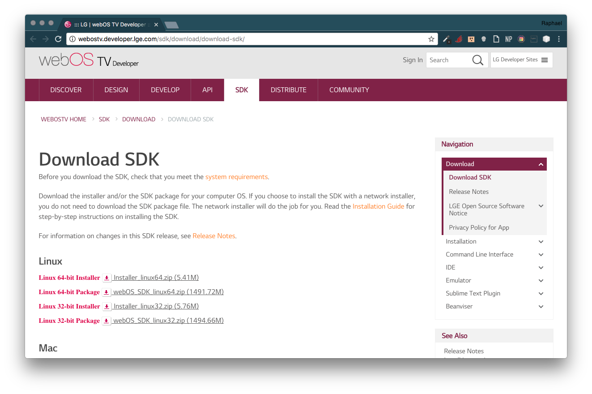

# Setup WebOS Environment

1. Go to [http://webostv.developer.lge.com/sdk/download/download-sdk/](http://webostv.developer.lge.com/sdk/download/download-sdk/)

2. Download the installer based on your platform.
3. Execute your Installer (If you're in Linux or Mac the Installer will ask for be executed with sudo). 
