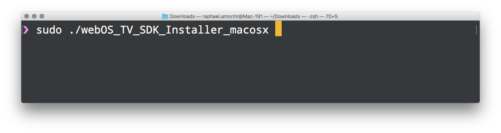
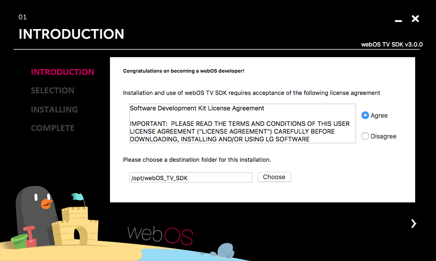
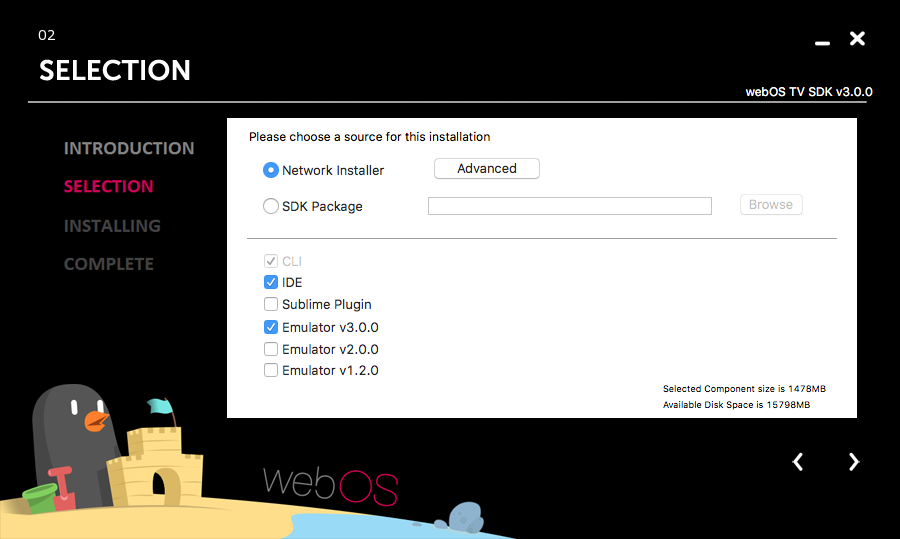
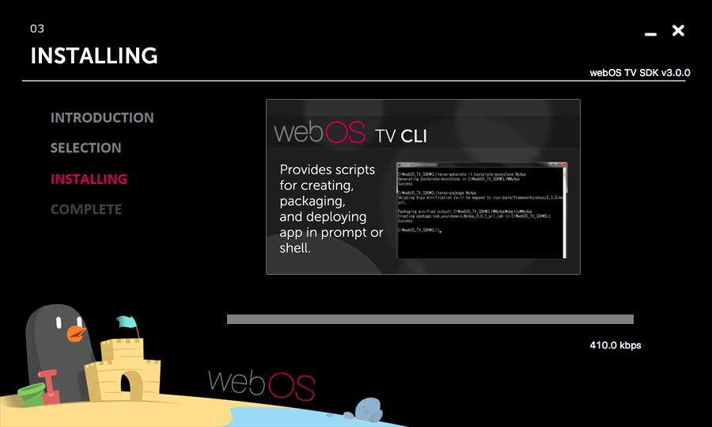
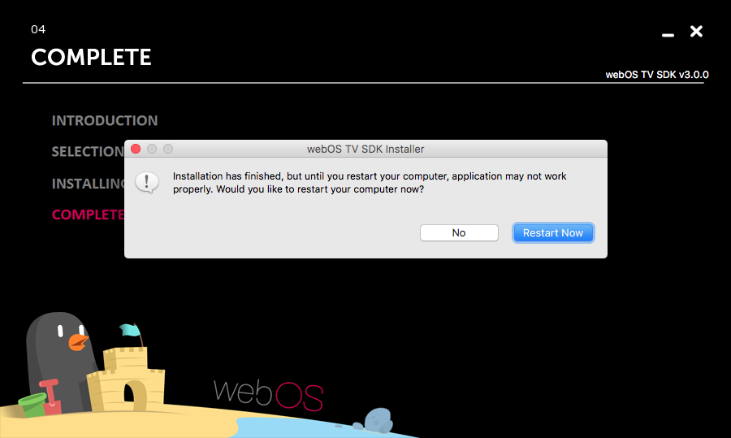

# Setup WebOS Environment

This Guide is considering that you are using linux / mac. The Windows installation process needs to be documented, please send a PR to help :)

Install the Package for your current OS:

### OSX

- [MacOS 64-bit Installer](https://github.com/raphamorim/react-tv/releases/download/0.3.0-alpha.1/webOS_TV_SDK_Installer_macosx.zip)

### Linux

- [Linux 64-bit Installer](https://github.com/raphamorim/react-tv/releases/download/0.3.0-alpha.1/webOS_TV_SDK_Installer_linux64.zip)
- [Linux 32-bit Installer](https://github.com/raphamorim/react-tv/releases/download/0.3.0-alpha.1/webOS_TV_SDK_Installer_linux32.zip)

### Windows

- [Windows 64-bit Installer](https://github.com/raphamorim/react-tv/releases/download/0.3.0-alpha.1/webOS_TV_SDK_Installer_win64.zip)
- [Windows 32-bit Installer](https://github.com/raphamorim/react-tv/releases/download/0.3.0-alpha.1/webOS_TV_SDK_Installer_win32.zip)

### Setting Up!

Execute your Installer (If you're in Linux or Mac the Installer will ask for be executed with sudo).

You pop the SDK Installer, select "Agree" about LG Agreement and choose the destination folder for this installation to continue.

Select only **"Emulator 3.0"** and **IDE**, then move foward.

You'll install all packages.

After installation step, restart your machine.

